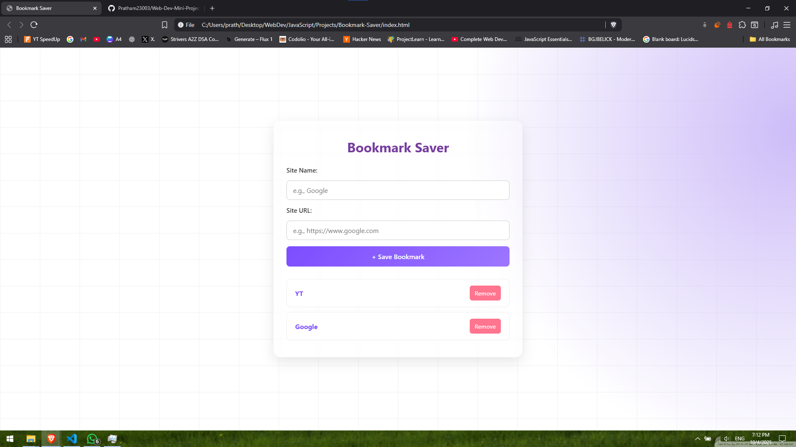

# Bookmark Saver

A simple, **modern bookmark saving application** with a clean UI, built using **vanilla HTML, CSS, and JavaScript**.  
It features **persistent localStorage**, instant adding and deleting of bookmarks, and a responsive design for easy management of your favorite links.

---

## Preview


*A minimalist bookmark manager with instant add/delete and persistent storage.*

---

## Features
- **Add & Delete Bookmarks**: Quickly save and remove your favorite website links.
- **Persistent Storage**: All bookmarks are saved automatically using **localStorage** – survives page refreshes!
- **Clickable Links**: Open saved bookmarks directly in a new tab.
- **Responsive Design**: Works perfectly on desktop, tablet, and mobile devices.
- **Zero Dependencies**: Pure vanilla JavaScript – no frameworks, no npm, no build process!

---

## Tech Stack
- **HTML** → Semantic structure and layout.
- **CSS** → Modern styling, responsive design.
- **JavaScript (ES6+)** → Application logic, DOM manipulation, and localStorage handling.

---

## How to Use
1. Download or clone all three files: `index.html`, `style.css`, and `script.js`.
2. Place them in the same folder.
3. Open `index.html` in any modern web browser.
4. **No installation required** – just double-click and start saving bookmarks!

---

## File Structure
```
Bookmark-Saver/
├── index.html          # Main HTML structure
├── style.css           # All styling and layout
├── script.js           # Application logic and localStorage
└── README.md           # Project documentation
```

---

## Usage Tips
- **Add Bookmark**: Enter the website name and URL → Click "Add Bookmark" or press Enter.
- **Open Bookmark**: Click on any saved bookmark to open it in a new tab.
- **Delete**: Click the "Delete" button next to any bookmark to remove it.
- **Persistent Storage**: All bookmarks are saved automatically and loaded on page refresh.

---